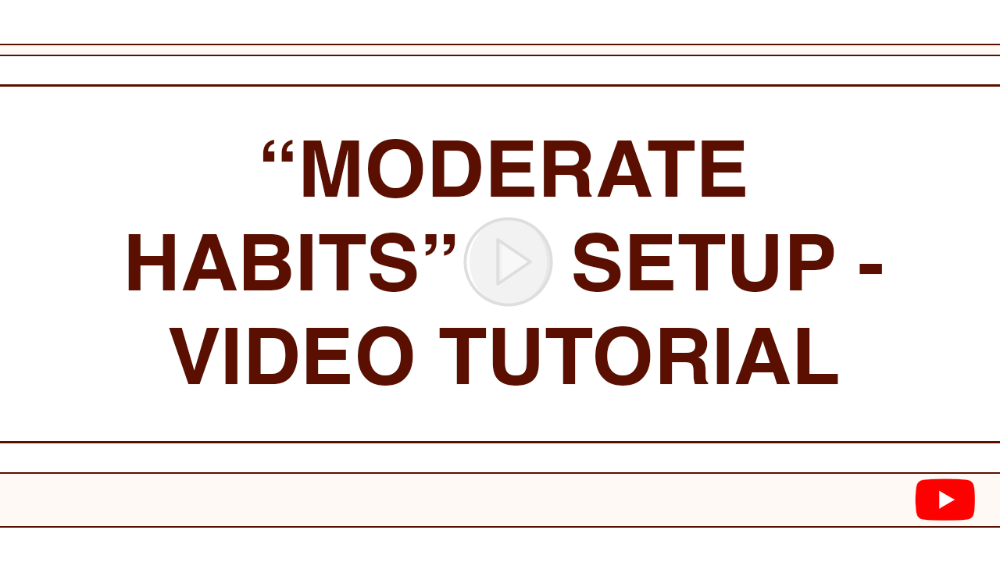

# Moderate Habits - Google Sheet Habit Tracker

Moderate Habits is a habit-tracking application built entirely within Google Sheets, powered by Google Apps Script. It helps you build consistency by tracking daily habits, managing streaks, and providing flexible "buffer" days so missing a single day doesn't break your momentum.

It's designed for those who want a simple, customizable, and free way to monitor their progress directly in a familiar spreadsheet environment.

## ✨ Features

* **Daily Habit Tracking:** Simple checkbox interface for marking daily completion.
* **Customizable Habits:** Define your habits using emojis in the `activities` column.
* **Streak Calculation:** Automatically tracks current and highest streaks based on completion.
* **Buffer Days:** Earn buffer days (rest days) for each habit, preventing streak resets on occasional misses.
* **Configurable Settings:**
  * Set the daily reset hour (e.g., 3 AM).
  * Configure the interval for earning buffer day boosts.
* **History Log:** Automatically logs daily completion, buffer status, and streaks to a separate 'history' sheet.
* **Date Navigation:** View and update data for past days within the current challenge using a date selector.
* **Dynamic Help:** Context-aware help sidebar explaining features based on the current sheet and mode.
* **First-Run Setup:** Guided setup process for new users.
* **Update Checker:** Option to check if a newer version of the script is available.
* **Termination Mode:** Option to formally stop tracking while preserving history.

## ⚙️ How It Works

* **`main` Sheet:** Your primary interface for daily tracking and viewing current status.
* **`history` Sheet:** A read-only log storing the data for each day.
* **Google Apps Script:** The backend logic handling:
  * Daily resets (via time-driven trigger).
  * Calculations (streaks, buffers).
  * Data saving and propagation between `main` and `history`.
  * UI updates (help sidebar, dialogs).
  * Event handling (`onOpen`, `onEdit`).

## 🚀 Setup Instructions

1. **Prerequisites:** You need a Google Account.
2. **Copy the Sheet:**
    * Make a copy of the Moderate Habits Google Sheet template:
    * **➡️ [Link to your Shareable Google Sheet Template Here] ⬅️**
    * *(Rename your copied sheet if desired)*
3. **Open the Sheet:** Open your newly copied Google Sheet.
4. **Run Initial Setup:**
    * Wait a few seconds for the custom menu "Moderate Habits Settings" to appear. *(It might take up to 30 seconds on the very first open).*
    * Click **Moderate Habits Settings > \*\*Begin\*\***.
5. **Authorize the Script:**
    * You will be asked to authorize the script. Click **Continue** / **OK**.
    * Choose your Google Account.
    * You'll likely see a "**Google hasn't verified this app**" screen because this script isn't published to the Marketplace. This is normal for custom scripts.
    * Click "**Advanced**".
    * Click "**Go to [Your Sheet Name] (unsafe)**".
    * Review the permissions the script needs (it primarily needs access to *this specific spreadsheet* to read/write data).
    * Click "**Allow**".
    * *Note: The script only interacts with the data within this specific Google Sheet document.*
6. **Set Up Habits:**
    * Follow the prompts. A welcome message will appear.
    * You will be guided to the **Habit Ideation** mode.
    * Go to the `main` sheet.
    * Enter your desired habits as **emojis** in the `activities` column (Column D). You can add non-emoji text for labels/headers too.
    * (Optional) Configure the `reset hour` and `boost interval` in the settings cells that appear on the right (Cells H6 and H8). Hover over them for notes.
    * Once you're happy with your habits and settings, **check the `set habits` checkbox** (Cell H3).
    * Confirm your setup.
7. **Start Tracking!** Your sheet is now ready. The tracking columns will appear, and today's date will be loaded.

## 💡 Usage Guide

* **Daily Tracking:** On the `main` sheet, check the boxes in the `completion` column for habits you've completed for the selected date.
* **Changing Dates:** Use the `date selector` cell (B9) to view or edit past days. Double-click for a calendar or type a date (YYYY-MM-DD). Data for the previous date is saved automatically when you change dates *after* marking completion.
* **Streaks & Buffers:** These are calculated automatically. Missing a habit reduces its buffer the *next* day. If the buffer is 0 and you miss it, the current streak resets to 0. Buffers increase automatically based on your `boost interval` setting.
* **Help:** Click **Moderate Habits Settings > Show Help (Current Page)** to open a sidebar with relevant information.
* **Detailed Guide:** For a more in-depth explanation, refer to the PDF Guide:
  * **➡️ [Link to your PDF Guide Here (e.g., hosted on Google Drive or in the repo)] ⬅️**

## 🔧 Troubleshooting

* **Menu Not Appearing:** The "Moderate Habits Settings" menu might take a few seconds (up to 30) to appear when you first open the sheet. Try reloading the page if it takes longer.
* **Authorization Issues:** If authorization keeps failing or looping, try removing the script's permissions from your Google Account settings (`Manage your Google Account -> Security -> Third-party apps with account access`) and then re-authorize by running a menu item again.
* **Errors Occurring:** If you encounter errors, check the script's execution logs: **Extensions > Apps Script > Executions**. This can provide details about what went wrong.
* **Performance:** Depending on the amount of history data, some actions (like changing dates far back) might take a few seconds to process.

## 🙏 Contributing

Contributions, issues, and feature requests are welcome! Feel free to check [issues page](https://github.com/marcusrprojects/moderate_habits/issues) if you want to contribute.

---

Happy habiting! 💪
